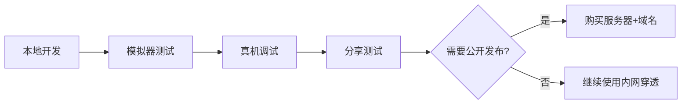

# Plant-DTP 微信小程序集成规划

## 一、项目概述

### 1.1 当前项目架构

**前端技术栈：**
- React 18.3 + TypeScript 5.4
- Vite 5.2 构建工具
- Ant Design 5.15 UI组件库
- React Router 6.22 路由管理
- @tanstack/react-query 5.28 数据请求
- Zustand 4.5 状态管理
- Tailwind CSS 3.4 样式框架

**后端技术栈：**
- Python 3.x
- FastAPI 框架
- SQLite 数据库
- RESTful API 设计

**核心功能模块：**
- 房间管理（Rooms）
- 花架管理（Shelves）
- 植物管理（Plants）
- 任务管理（Tasks）
- 养护记录（Care Logs）
- 统计分析（Dashboard）

### 1.2 小程序化目标

将现有的 Web 应用转换为微信小程序，实现：
- 保持核心业务逻辑和功能
- 提供移动端友好的交互体验
- 利用微信生态能力（分享、支付等）
- 保持与现有后端API的兼容性

---

## 二、技术方案选型

### 2.1 框架选择：Taro 3.x/4.x

**选择理由：**
1. ✅ **React技术栈**：与现有前端代码高度兼容
2. ✅ **多端支持**：一套代码可编译到微信、支付宝、抖音等多平台
3. ✅ **成熟稳定**：京东开源，社区活跃，文档完善
4. ✅ **组件丰富**：提供 Taro UI、Taroify 等组件库
5. ✅ **开发体验**：支持 TypeScript、Hooks、Redux/Zustand 等

**技术栈映射：**
| 现有技术 | Taro 对应方案 |
|---------|--------------|
| React | ✅ 完全兼容 |
| TypeScript | ✅ 完全兼容 |
| React Router | ❌ 改用 Taro 路由 |
| Ant Design | ⚠️ 迁移到 Taro UI / NutUI |
| Axios | ✅ 可继续使用或用 Taro.request |
| Zustand | ✅ 完全兼容 |
| Tailwind CSS | ⚠️ 需配置或改用原生 CSS/SCSS |

### 2.2 其他可选方案

#### 方案二：uni-app（Vue技术栈）
- ❌ 需要重写所有 React 代码
- ✅ 组件库丰富（uni-ui）
- ✅ 社区活跃

#### 方案三：原生小程序开发
- ❌ 开发效率低
- ❌ 无法复用现有代码
- ✅ 性能最优
- ✅ 功能最全

**推荐结论：使用 Taro 框架**

---

## 三、架构设计

### 3.1 整体架构

```
┌─────────────────────────────────────────┐
│         微信小程序客户端                  │
│  (Taro + React + TypeScript)            │
│                                         │
│  ┌──────────┐  ┌──────────┐  ┌───────┐ │
│  │ 页面层   │  │ 组件层   │  │ 状态管理│ │
│  └──────────┘  └──────────┘  └───────┘ │
└─────────────────────────────────────────┘
                    │
                    ▼
┌─────────────────────────────────────────┐
│         现有 FastAPI 后端                │
│  (无需改动，复用现有 API)                │
└─────────────────────────────────────────┘
```

### 3.2 目录结构

```
miniprogram/
├── src/
│   ├── pages/              # 页面
│   │   ├── dashboard/      # 仪表板（首页）
│   │   ├── rooms/          # 房间列表
│   │   ├── plants/         # 植物列表
│   │   ├── tasks/          # 任务列表
│   │   └── plant-detail/   # 植物详情
│   ├── components/         # 组件
│   │   ├── plant-card/     # 植物卡片
│   │   ├── task-list-item/ # 任务列表项
│   │   ├── room-card/      # 房间卡片
│   │   └── modal/          # 弹窗组件
│   ├── services/           # API 服务
│   │   ├── api.ts          # API 基础配置
│   │   ├── room.ts         # 房间 API
│   │   ├── plant.ts        # 植物 API
│   │   └── task.ts         # 任务 API
│   ├── store/              # 状态管理
│   │   └── index.ts        # Zustand store
│   ├── hooks/              # 自定义 Hooks
│   ├── utils/              # 工具函数
│   ├── app.config.ts       # 应用配置
│   ├── app.ts              # 应用入口
│   └── app.scss            # 全局样式
├── config/                 # 编译配置
│   ├── index.ts            # Taro 配置
│   └── dev.ts              # 开发环境配置
├── package.json
└── tsconfig.json
```

### 3.3 路由设计

使用 Taro 的路由系统（基于 app.config.ts）：

```typescript
// app.config.ts
export default {
  pages: [
    'pages/dashboard/index',        // 首页
    'pages/rooms/index',            // 房间列表
    'pages/plants/index',           // 植物列表
    'pages/tasks/index',            // 任务列表
    'pages/plant-detail/index',     // 植物详情
    'pages/room-detail/index',      // 房间详情
  ],
  tabBar: {
    color: '#999',
    selectedColor: '#1890ff',
    backgroundColor: '#fff',
    list: [
      { pagePath: 'pages/dashboard/index', text: '首页', iconPath: '...', selectedIconPath: '...' },
      { pagePath: 'pages/rooms/index', text: '房间', iconPath: '...', selectedIconPath: '...' },
      { pagePath: 'pages/plants/index', text: '植物', iconPath: '...', selectedIconPath: '...' },
      { pagePath: 'pages/tasks/index', text: '任务', iconPath: '...', selectedIconPath: '...' },
    ]
  },
  window: {
    backgroundTextStyle: 'light',
    navigationBarBackgroundColor: '#fff',
    navigationBarTitleText: '植物管家',
    navigationBarTextStyle: 'black'
  }
}
```

---

## 四、核心功能迁移计划

### 4.1 页面迁移映射

| 原有页面 | 小程序页面 | 迁移难度 | 说明 |
|---------|-----------|---------|------|
| Dashboard | pages/dashboard | ⭐⭐⭐ | 需重构布局，适配移动端 |
| Rooms | pages/rooms | ⭐⭐ | 相对简单，主要是列表展示 |
| Plants | pages/plants | ⭐⭐ | 需优化图片加载和筛选功能 |
| Tasks | pages/tasks | ⭐⭐ | 需优化交互体验 |
| PlantCard Modal | pages/plant-detail | ⭐⭐⭐⭐ | 改为全屏页面 |
| RoomFormModal | pages/room-form | ⭐⭐⭐ | 改为全屏表单页面 |

### 4.2 组件迁移映射

| 原有组件 | 小程序对应方案 | 迁移难度 |
|---------|--------------|---------|
| Ant Design Card | View + 自定义样式 | ⭐⭐ |
| Ant Design List | View 列表 | ⭐ |
| Ant Design Button | Taro Button (taro-ui) | ⭐ |
| Ant Design Modal | Taro Modal / 自定义 | ⭐⭐⭐ |
| Ant Design Form | Taro Form / 自定义 | ⭐⭐⭐⭐ |
| Ant Design Upload | Taro Upload / 自定义 | ⭐⭐⭐⭐ |
| Ant Design Icon | Icon字体图片 | ⭐⭐ |

### 4.3 API 适配

**请求方式变化：**

```typescript
// 原有方式（Axios）
import axios from 'axios'

const api = axios.create({
  baseURL: 'http://localhost:3000/api'
})

// Taro 方式（推荐使用 Taro.request）
import Taro from '@tarojs/taro'

const api = {
  request: (options) => {
    return Taro.request({
      url: `${BASE_URL}${options.url}`,
      method: options.method || 'GET',
      data: options.data,
      header: {
        'Content-Type': 'application/json',
        ...options.header
      }
    })
  }
}

// 或者继续使用 Axios（需配置适配器）
import axios from 'axios'
import Taro from '@tarojs/taro'

const api = axios.create({
  baseURL: 'http://localhost:3000/api',
  adapter: Taro.request as any
})
```

**API 配置文件：**

```typescript
// src/services/api.ts
export const BASE_URL = 'https://your-domain.com/api'

export const request = (options: RequestOptions) => {
  return Taro.request({
    url: `${BASE_URL}${options.url}`,
    method: options.method || 'GET',
    data: options.data,
    header: {
      'Content-Type': 'application/json',
      'Authorization': Taro.getStorageSync('token') || '',
      ...options.header
    }
  }).then(response => {
    if (response.statusCode >= 200 && response.statusCode < 300) {
      return response.data
    }
    throw new Error(response.data.message || '请求失败')
  })
}
```

---

## 五、关键技术难点与解决方案

### 5.1 UI 组件库迁移

**问题：** Ant Design 不支持小程序环境

**解决方案：**

1. **使用 NutUI（推荐）**
   ```bash
   npm install nutui-react-taro
   ```
   - React + Taro 专用
   - 组件丰富，设计现代
   - 支持按需引入

2. **使用 Taro UI**
   ```bash
   npm install taro-ui
   ```
   - 官方组件库
   - 稳定可靠
   - 样式相对传统

3. **自定义组件**
   - 根据设计稿手写组件
   - 完全可控
   - 开发成本高

**推荐：NutUI + 部分自定义组件**

### 5.2 图片上传

**原有代码：**
```tsx
<Upload
  customRequest={uploadImage}
  listType="picture-card"
>
  <Button icon={<UploadOutlined />}>上传图片</Button>
</Upload>
```

**Taro 实现：**
```tsx
import Taro from '@tarojs/taro'

const handleUpload = async () => {
  const res = await Taro.chooseImage({
    count: 1,
    sizeType: ['compressed'],
    sourceType: ['album', 'camera']
  })

  const tempFilePath = res.tempFilePaths[0]

  // 上传到服务器
  const uploadRes = await Taro.uploadFile({
    url: `${BASE_URL}/plants/${plantId}/images`,
    filePath: tempFilePath,
    name: 'file',
    header: {
      'Authorization': token
    }
  })

  const data = JSON.parse(uploadRes.data)
  return data.data
}
```

### 5.3 表单处理

**使用 react-hook-form 的替代方案：**

```tsx
// 继续使用 react-hook-form（Taro 支持）
import { useForm } from 'react-hook-form'

const PlantForm = () => {
  const { register, handleSubmit, formState: { errors } } = useForm()

  const onSubmit = (data) => {
    // 提交逻辑
  }

  return (
    <View>
      <Input
        {...register('name', { required: '请输入植物名称' })}
        placeholder="植物名称"
      />
      {errors.name && <Text>{errors.name.message}</Text>}
    </View>
  )
}
```

### 5.4 状态管理

**继续使用 Zustand（无需改动）：**

```typescript
// store/index.ts
import create from 'zustand/vanilla'

interface PlantStore {
  plants: Plant[]
  fetchPlants: () => Promise<void>
  addPlant: (plant: Plant) => void
}

export const usePlantStore = create<PlantStore>((set, get) => ({
  plants: [],
  fetchPlants: async () => {
    const data = await fetchPlantsAPI()
    set({ plants: data })
  },
  addPlant: (plant) => {
    set({ plants: [...get().plants, plant] })
  }
}))
```

### 5.5 路由导航

**React Router → Taro 路由：**

```typescript
// 原有方式
import { useNavigate } from 'react-router-dom'

const navigate = useNavigate()
navigate('/plants/123')

// Taro 方式
import Taro from '@tarojs/taro'

// 跳转到页面
Taro.navigateTo({
  url: '/pages/plant-detail/index?id=123'
})

// 返回上一页
Taro.navigateBack()

// 切换 Tab
Taro.switchTab({
  url: '/pages/dashboard/index'
})
```

### 5.6 下拉刷新和上拉加载

```tsx
import { usePullDownRefresh, useReachBottom } from '@tarojs/taro'
import { useCallback } from 'react'

const PlantList = () => {
  const [plants, setPlants] = useState([])
  const [page, setPage] = useState(1)
  const [hasMore, setHasMore] = useState(true)

  // 下拉刷新
  usePullDownRefresh(async () => {
    await loadPlants(1)
    Taro.stopPullDownRefresh()
  })

  // 上拉加载
  useReachBottom(() => {
    if (hasMore) {
      loadPlants(page + 1)
    }
  })

  return (
    <View>{/* 列表内容 */}</View>
  )
}
```

---

## 六、实施步骤

### 第一阶段：环境搭建（1-2天）

1. **安装 Taro 脚手架**
   ```bash
   npm install -g @tarojs/cli
   taro init plant-dtp-miniprogram
   ```

2. **选择配置**
   - 框架：React
   - 语言：TypeScript
   - CSS 预处理器：SCSS
   - 模板：默认模板

3. **配置开发环境**
   ```bash
   cd plant-dtp-miniprogram
   npm install
   npm install @nutui/nutui-react-taro zustand react-hook-form dayjs
   ```

4. **配置编译选项**
   ```typescript
   // config/index.ts
   export default {
     framework: 'react',
     compiler: {
       type: 'webpack5'
     }
   }
   ```

### 第二阶段：基础架构搭建（3-5天）

1. **配置 API 服务层**
   - 创建 `src/services/` 目录
   - 配置 request 拦截器
   - 迁移 API 接口定义

2. **配置状态管理**
   - 设置 Zustand store
   - 定义全局状态结构

3. **创建基础组件**
   - 页面布局组件
   - 卡片组件
   - 列表组件
   - 弹窗组件

4. **配置路由和导航**
   - 设置 app.config.ts
   - 配置 TabBar

### 第三阶段：页面迁移（10-15天）

**优先级排序：**

1. **P0（核心页面）- 5天**
   - ✅ 仪表板（Dashboard）
   - ✅ 任务列表（Tasks）
   - ✅ 植物列表（Plants）

2. **P1（重要页面）- 5天**
   - ✅ 房间列表（Rooms）
   - ✅ 植物详情（PlantDetail）
   - ✅ 任务详情（TaskDetail）

3. **P2（辅助页面）- 5天**
   - ✅ 房间详情（RoomDetail）
   - ✅ 表单页面（PlantForm、RoomForm）
   - ✅ 统计页面（Stats）

### 第四阶段：功能完善（5-7天）

1. **交互优化**
   - 下拉刷新
   - 上拉加载
   - 页面骨架屏
   - 加载状态优化

2. **数据缓存**
   - 本地存储
   - 图片缓存

3. **错误处理**
   - 网络异常提示
   - 表单验证
   - 友好的错误提示

4. **性能优化**
   - 图片懒加载
   - 分包加载
   - 代码分包

### 第五阶段：测试与发布（3-5天）

1. **功能测试**
   - 单元测试
   - 集成测试
   - 用户验收测试

2. **兼容性测试**
   - 不同微信版本
   - 不同设备型号
   - iOS vs Android

3. **性能测试**
   - 启动速度
   - 页面加载速度
   - 内存占用

4. **提交审核**
   - 配置服务器域名白名单
   - 准备审核材料
   - 提交微信审核

---

## 七、个人免费开发方案 ⭐推荐

> **好消息：** 个人开发和小范围使用，完全**不需要购买域名和服务器**！

### 7.1 方案一：微信开发者工具本地调试（最简单）

**适用场景：** 开发阶段、自己测试

**操作步骤：**

1. **打开微信开发者工具**
2. **点击右上角「详情」按钮**
3. **在「本地设置」选项卡中勾选：**
   - ✅ **不校验合法域名、web-view（业务域名）、TLS版本以及HTTPS证书**
   - ✅ **不校验合法域名、web-view（业务域名）、TLS版本以及HTTPS证书**

```
┌─────────────────────────────────┐
│  微信开发者工具                  │
│                                 │
│  详情 → 本地设置                 │
│                                 │
│  ☑ 不校验合法域名               │
│  ☑ 不校验 web-view域名          │
│  ☑ 不校验 TLS版本及HTTPS证书    │
└─────────────────────────────────┘
```

**优点：**
- ✅ **完全免费**，无需任何工具
- ✅ 操作最简单，一键开启
- ✅ 支持模拟器调试
- ✅ 支持真机调试（需在手机微信中开启调试模式）

**API 配置示例：**

```typescript
// src/services/api.ts
export const BASE_URL = 'http://localhost:3000/api'  // 本地地址

export const request = (options: RequestOptions) => {
  return Taro.request({
    url: `${BASE_URL}${options.url}`,
    method: options.method || 'GET',
    data: options.data,
    header: {
      'Content-Type': 'application/json',
      ...options.header
    }
  })
}
```

**真机调试步骤：**
1. 在微信开发者工具中点击「预览」
2. 用微信扫描二维码
3. 在手机微信中打开小程序
4. 打开小程序右上角「...」→ 打开调试
5. 即可在手机上访问本地后端服务

---

### 7.2 方案二：免费内网穿透（推荐用于真机调试）

**适用场景：** 需要在真实手机上测试、分享给朋友测试

#### 推荐工具对比

| 工具 | 免费方案 | 优点 | 缺点 | 推荐度 |
|------|---------|------|------|--------|
| **Ngrok** | ✅ 免费版 | 国际通用、稳定 | 国内速度慢 | ⭐⭐⭐ |
| **NATAPP** | ✅ 免费版 | 国内速度快、专门支持微信 | 免费版域名会变化 | ⭐⭐⭐⭐⭐ |
| **花生壳** | ⚠️ 限速 | 老牌工具、稳定 | 免费版限制多 | ⭐⭐⭐ |
| **Cpolar** | ✅ 免费版 | 支持固定子域名（付费） | 免费版随机域名 | ⭐⭐⭐⭐ |
| **Loca** | ✅ 完全免费 | 新工具、速度快 | 文档较少 | ⭐⭐⭐⭐ |

#### 7.2.1 NATAPP（最推荐）

**官网：** https://natapp.cn/

**特点：**
- ✅ **专门针对微信小程序优化**
- ✅ 国内访问速度快
- ✅ 提供免费隧道
- ✅ 支持HTTP和HTTPS

**使用步骤：**

1. **注册账号并登录**
   ```
   访问：https://natapp.cn/
   注册并登录 → 购买/开通免费隧道
   ```

2. **创建免费隧道**
   - 隧道类型：选择 `HTTP` 或 `HTTPS`
   - 本地端口：`3000`（你的 FastAPI 端口）
   - 域名：系统自动分配（如：`abc123.natappfree.cc`）

3. **下载客户端**
   ```bash
   # Linux/Mac
   wget https://cdn.natapp.cn/assets/downloads/natapp_linux_amd64_3_2_3.zip

   # Windows
   下载 natapp_windows_amd64_3_2_3.zip
   ```

4. **启动隧道**
   ```bash
   # Linux/Mac
   chmod +x natapp
   ./natapp -authtoken=你的authtoken

   # Windows
   natapp.exe -authtoken=你的authtoken
   ```

5. **获取公网地址**
   ```
   Tunnel Status online                       [版本号]
   Forwarding https://abc123.natappfree.cc  -> localhost:3000
   ```

6. **配置小程序 API**
   ```typescript
   // 开发环境使用内网穿透地址
   export const BASE_URL = 'https://abc123.natappfree.cc/api'
   ```

7. **在微信开发者工具中关闭域名校验**（见方案一）

#### 7.2.2 Ngrok（国际方案）

**官网：** https://ngrok.com/

**特点：**
- ✅ 国际通用，文档丰富
- ✅ 提供 Web UI 查看请求
- ⚠️ 国内访问速度较慢

**使用步骤：**

1. **注册并下载**
   ```bash
   # 下载地址：https://ngrok.com/download
   unzip ngrok-v3-stable-linux-amd64.zip
   ```

2. **配置 authtoken**
   ```bash
   ./ngrok config add-authtoken 你的token
   ```

3. **启动隧道**
   ```bash
   ./ngrok http 3000
   ```

4. **获取公网地址**
   ```
   Forwarding  https://abc1-23-456-789.ngrok-free.app  -> http://localhost:3000
   ```

#### 7.2.3 Cpolar（国内方案）

**官网：** https://www.cpolar.com/

**特点：**
- ✅ 国内速度快
- ✅ 支持固定子域名（付费）
- ✅ 完全免费无广告

**使用步骤：**

1. **注册并安装**
   ```bash
   # Linux
   curl -L https://www.cpolar.com/static/downloads/install-release-cpolar.sh | sudo bash

   # 查看版本
   cpolar version
   ```

2. **创建隧道**
   ```bash
   # HTTP 隧道
   cpolar http 3000
   ```

3. **获取公网地址**
   ```
   Tunnel established at: https://abc123.cpolar.cn
   ```

#### 7.2.4 内网穿透工具配置对比

```bash
# NATAPP
./natapp -authtoken=你的token
# 输出：https://xxx.natappfree.cc

# Ngrok
./ngrok http 3000
# 输出：https://xxx.ngrok-free.app

# Cpolar
cpolar http 3000
# 输出：https://xxx.cpolar.io

# FRP（自建服务器）
./frpc -c frpc.ini
# 需要自己有服务器
```

---

### 7.3 方案三：微信测试号（完整功能测试）

**适用场景：** 需要测试微信登录、分享、支付等微信原生功能

**操作步骤：**

1. **申请测试号**
   ```
   访问：https://mp.weixin.qq.com/debug/cgi-bin/sandbox?t=sandbox/login
   微信扫码登录
   ```

2. **获取测试号信息**
   - appID 和 appsecret
   - 测试号二维码

3. **配置服务器域名**
   ```
   在测试号管理界面设置：
   - 接口配置：填写内网穿透地址
   - JS接口安全域名：填写内网穿透域名
   - 网页账号：填写内网穿透域名
   ```

4. **在 Taro 项目中配置**
   ```typescript
   // project.config.json
   {
     "appid": "测试号appid",
     "projectname": "Plant-DTP"
   }
   ```

**优点：**
- ✅ 可以测试所有微信接口
- ✅ 无需认证，免费使用
- ✅ 权限完整

**缺点：**
- ⚠️ 测试号有数量限制（100个关注用户）
- ⚠️ 不能正式发布

---

### 7.4 三种方案对比总结

| 方案 | 成本 | 难度 | 使用场景 | 推荐度 |
|------|------|------|---------|--------|
| **方案一：关闭域名校验** | 完全免费 | ⭐ 极简单 | 开发阶段、模拟器测试 | ⭐⭐⭐⭐⭐ |
| **方案二：内网穿透** | 完全免费 | ⭐⭐ 简单 | 真机调试、分享测试 | ⭐⭐⭐⭐⭐ |
| **方案三：微信测试号** | 完全免费 | ⭐⭐⭐ 中等 | 测试微信原生功能 | ⭐⭐⭐⭐ |

### 7.5 个人开发推荐配置

#### 阶段一：本地开发（0成本）
```
前端：微信开发者工具（关闭域名校验）
后端：本地 FastAPI（localhost:3000）
数据库：本地 SQLite
总成本：¥0
```

#### 阶段二：真机测试（0成本）
```
前端：微信开发者工具
后端：本地 FastAPI + NATAPP（内网穿透）
数据库：本地 SQLite
总成本：¥0
```

#### 阶段三：分享给朋友（0成本）
```
前端：微信开发者工具（预览二维码）
后端：本地 FastAPI + NATAPP（内网穿透）
数据库：本地 SQLite
分享方式：微信扫二维码
总成本：¥0
```

#### 阶段四：正式发布（可选）
```
如果需要公开发布到微信小程序商店：
- 小程序认证费：¥300/年
- 云服务器：¥200-500/月（可选）
- 域名 + HTTPS证书：¥50-100/年（可选）

但是个人使用完全可以不发布！
```

---

### 7.6 最佳实践建议

#### 开发流程推荐



#### 配置文件示例

```typescript
// src/config/index.ts
export const CONFIG = {
  // 开发环境 - 本地调试
  development: {
    API_BASE_URL: 'http://localhost:3000/api',
    IMG_BASE_URL: 'http://localhost:3000'
  },

  // 测试环境 - 内网穿透
  test: {
    API_BASE_URL: 'https://abc123.natappfree.cc/api',
    IMG_BASE_URL: 'https://abc123.natappfree.cc'
  },

  // 生产环境 - 正式服务器（可选）
  production: {
    API_BASE_URL: 'https://your-domain.com/api',
    IMG_BASE_URL: 'https://your-domain.com'
  }
}

// 根据环境变量自动选择
export const getEnvConfig = () => {
  const env = process.env.NODE_ENV || 'development'
  return CONFIG[env]
}
```

#### 自动化脚本

```bash
#!/bin/bash
# start-dev.sh - 开发环境启动脚本

echo "🚀 启动 Plant-DTP 开发环境..."

# 启动后端服务
echo "📡 启动 FastAPI 后端..."
cd backend
python -m uvicorn app.main:app --host 0.0.0.0 --port 3000 &
BACKEND_PID=$!

# 启动内网穿透（可选）
echo "🌐 启动 NATAPP 内网穿透..."
cd ../tools
./natapp -authtoken=你的token &
NATAPP_PID=$!

echo "✅ 服务启动完成！"
echo "后端地址：http://localhost:3000"
echo "内网地址：见 NATAPP 终端输出"
echo ""
echo "按 Ctrl+C 停止所有服务"

# 等待中断信号
wait
```

---

### 7.7 常见问题 FAQ

**Q1: 内网穿透的域名会变吗？**
- A: 免费版的域名每次启动都会变化，但可以在小程序配置中使用通配符或动态更新

**Q2: 内网穿透安全吗？**
- A: 建议添加访问密码或IP白名单，生产环境建议使用正式服务器

**Q3: 不购买服务器可以长期使用吗？**
- A: 可以！内网穿透适合个人长期使用，只是稳定性不如云服务器

**Q4: 需要备案吗？**
- A: 个人开发、内网穿透完全不需要备案。只有购买国内服务器和域名才需要

**Q5: 能给朋友用吗？**
- A: 可以！通过微信开发者工具的「预览」功能生成二维码，朋友扫码即可使用

**Q6: 小程序能公开发布吗？**
- A: 公开发布需要¥300/年的认证费和服务器，但个人使用完全可以不发布

---

### 7.8 小结

**对于个人开发者：**
- ✅ **完全可以零成本开发**
- ✅ **无需购买域名和服务器**
- ✅ **使用内网穿透即可实现真机调试**
- ✅ **通过预览二维码可以分享给朋友使用**
- ✅ **不需要发布到小程序商店**

**推荐方案：**
1. **日常开发**：关闭域名校验 + 本地后端
2. **真机测试**：NATAPP 内网穿透 + 手机调试模式
3. **分享使用**：预览二维码 + 内网穿透

---

## 八、后端适配

### 8.1 域名配置

微信小程序要求使用 HTTPS 域名，需要：

1. **申请 SSL 证书**
   - 阿里云 / 腾讯云免费证书
   - 配置 Nginx/Apache

2. **配置服务器域名白名单**
   ```
   登录微信公众平台 → 开发 → 开发管理 → 服务器域名
   - request合法域名：https://your-api.com
   - uploadFile合法域名：https://your-api.com
   - downloadFile合法域名：https://your-api.com
   ```

3. **CORS 配置**
   ```python
   # backend/app/main.py
   from fastapi.middleware.cors import CORSMiddleware

   app.add_middleware(
       CORSMiddleware,
       allow_origins=[
           "https://your-frontend.com",
           "https://servicewechat.com"  # 微信小程序域名
       ],
       allow_credentials=True,
       allow_methods=["*"],
       allow_headers=["*"],
   )
   ```

### 8.2 API 兼容性检查

现有 API 完全兼容，无需修改。确保：

- ✅ 使用 HTTPS
- ✅ 响应时间 < 3秒
- ✅ 数据大小合理（小程序有 2MB 请求限制）
- ✅ 支持分页加载

---

## 九、成本估算

### 9.1 开发成本

| 阶段 | 工作量 | 说明 |
|-----|-------|------|
| 环境搭建 | 1-2天 | 项目初始化、依赖安装 |
| 架构搭建 | 3-5天 | 服务层、状态管理、基础组件 |
| 页面迁移 | 10-15天 | 主要页面开发 |
| 功能完善 | 5-7天 | 交互优化、性能优化 |
| 测试发布 | 3-5天 | 测试、审核、上线 |
| **总计** | **22-34天** | 约1-1.5个月 |

### 9.2 运营成本

#### 个人免费开发（推荐）

| 项目 | 费用 | 说明 |
|-----|------|------|
| 开发工具 | ¥0 | 微信开发者工具免费 |
| 本地服务器 | ¥0 | 使用现有电脑 |
| 内网穿透 | ¥0 | NATAPP 免费版 |
| 数据库 | ¥0 | SQLite 本地数据库 |
| 域名 | ¥0 | 内网穿透提供免费域名 |
| **总计** | **¥0** | **完全免费！** |

#### 正式发布（可选）

| 项目 | 费用 | 说明 |
|-----|------|------|
| 服务器 | ¥200-500/月 | 云服务器 + HTTPS证书 |
| 域名 | ¥50-100/年 | .com 或 .cn 域名 |
| CDN | ¥100-300/月 | 图片加速（可选） |
| 小程序认证 | ¥300/年 | 微信认证费用 |

> **注意：** 个人使用和分享给朋友使用，完全不需要购买服务器和域名！

---

## 十、风险评估与应对

### 10.1 技术风险

| 风险 | 影响 | 应对措施 |
|-----|------|---------|
| Taro 版本兼容问题 | 中 | 锁定依赖版本，充分测试 |
| 组件库功能不足 | 中 | 混合使用多个组件库，自研部分组件 |
| 性能问题 | 高 | 代码分包、懒加载、图片优化 |
| 审核不通过 | 中 | 仔细阅读审核规范，准备备用方案 |

### 10.2 业务风险

| 风险 | 影响 | 应对措施 |
|-----|------|---------|
| 用户接受度低 | 中 | 充分调研用户需求，提供引导教程 |
| 竞品压力大 | 中 | 突出核心特色功能 |
| 维护成本高 | 低 | 建立完善的开发文档和代码规范 |

---

## 十一、后续优化方向

### 11.1 功能增强

1. **微信原生能力集成**
   - 模板消息推送（任务提醒）
   - 微信支付（付费功能）
   - 分享功能（分享植物图片）
   - 扫码功能（快速识别植物）

2. **智能功能**
   - AI 植物识别
   - 智能养护建议
   - 图像病害检测

3. **社交功能**
   - 植物社区
   - 养护经验分享
   - 植物交换

### 11.2 技术优化

1. **性能优化**
   - 虚拟列表（长列表优化）
   - 图片压缩和CDN
   - 骨架屏预加载

2. **用户体验**
   - 离线缓存
   - 手势操作
   - 暗黑模式

3. **数据分析**
   - 埋点统计
   - 用户行为分析
   - A/B测试

---

## 十二、学习资源

### 官方文档

- [Taro 官方文档](https://docs.taro.zone/docs/)
- [Taro React 指南](https://docs.taro.zone/docs/react-overall)
- [微信小程序官方文档](https://developers.weixin.qq.com/miniprogram/dev/framework/)

### 组件库

- [NutUI React Taro](https://nutui.jd.com/react/taro/)
- [Taro UI](https://taro-ui.jd.com/)

### 教程推荐

- [Taro 开发微信小程序全流程技术总结](https://blog.csdn.net/qq_43548436/article/details/156596254)
- [2025 微信小程序开发入门指南](https://blog.csdn.net/2301_81512868/article/details/151589111)

### 视频教程

- [2025年微信小程序开发教程（B站）](https://www.bilibili.com/video/BV1gT2DBCEBg/)

---

## 十三、总结

### 核心建议

1. ✅ **使用 Taro 框架**：最大化复用现有 React 代码
2. ✅ **采用 NutUI + 自定义组件**：平衡开发效率和UI定制
3. ✅ **保持后端 API 不变**：降低迁移成本
4. ✅ **分阶段实施**：从核心功能开始，逐步完善
5. ✅ **重视性能优化**：小程序环境限制较多，需提前规划

### 关键成功因素

- 🎯 充分的前期调研和设计
- 🎯 合理的里程碑规划
- 🎯 持续的测试和优化
- 🎯 良好的文档和代码规范
- 🎯 及时的问题解决和风险控制

### 预期收益

- 📱 **多端覆盖**：一次开发，支持微信、支付宝等多平台
- 💰 **成本节约**：复用现有代码，降低30-50%开发成本
- ⏱️ **快速上线**：1-1.5个月完成开发并上线
- 📈 **用户增长**：借助微信生态，快速获取用户

---

**文档版本：** v1.0
**更新日期：** 2025-01-25
**维护者：** Plant-DTP Team
