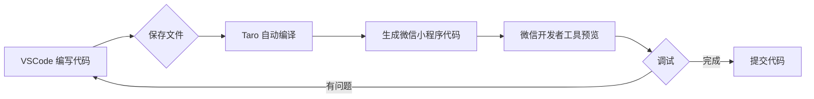

# VSCode 开发微信小程序完整指南

## 📋 目录

1. [开发方案对比](#一开发方案对比)
2. [VSCode 插件安装](#二vscode-插件安装)
3. [项目配置](#三项目配置)
4. [Taro + VSCode 开发流程](#四taro--vscode-开发流程)
5. [调试方案](#五调试方案)
6. [最佳实践](#六最佳实践)
7. [常见问题](#七常见问题)

---

## 一、开发方案对比

### 方案对比表

| 方案 | 开发效率 | 调试便利性 | 发布便利性 | 推荐度 |
|------|---------|-----------|-----------|--------|
| **纯微信开发者工具** | ⭐⭐ | ⭐⭐⭐⭐⭐ | ⭐⭐⭐⭐⭐ | ⭐⭐⭐ |
| **VSCode + 微信开发者工具** | ⭐⭐⭐⭐⭐ | ⭐⭐⭐⭐ | ⭐⭐⭐⭐ | ⭐⭐⭐⭐⭐ |
| **纯 VSCode（不可行）** | - | ❌ | ❌ | ❌ |

### 推荐方案：VSCode + 微信开发者工具

```
┌─────────────────────────────────────┐
│         开发流程                     │
├─────────────────────────────────────┤
│ 1. VSCode：编写代码（95%时间）       │
│    - 代码编辑                       │
│    - 语法高亮                       │
│    - 智能提示                       │
│    - 代码补全                       │
│                                     │
│ 2. 微信开发者工具（5%时间）          │
│    - 预览效果                       │
│    - 调试代码                       │
│    - 真机测试                       │
│    - 上传发布                       │
└─────────────────────────────────────┘
```

**优势：**
- ✅ VSCode 强大的编辑功能
- ✅ 丰富的插件生态
- ✅ 熟悉的开发环境
- ✅ 保留微信开发者工具的调试能力
- ✅ 两者自动同步，无需手动刷新

---

## 二、VSCode 插件安装

### 2.1 必装插件（Taro 开发）

#### 1. **minapp** ⭐⭐⭐⭐⭐ 最推荐

**功能：**
- ✅ WXML、WXSS、WXS 语法高亮
- ✅ 标签名和属性自动补全
- ✅ 属性值自动补全
- ✅ 点击跳转到 JS/TS 定义
- ✅ 支持原生小程序、Taro、uni-app

**安装方式：**
```bash
# 方式一：VSCode 插件市场搜索
1. 打开 VSCode
2. 点击左侧扩展图标（Ctrl+Shift+X）
3. 搜索 "minapp"
4. 点击安装

# 方式二：命令行安装
code --install-extension iehong.miniprogram-minapp
```

#### 2. **Taro Helper** ⭐⭐⭐⭐⭐ Taro 专用

**功能：**
- ✅ Taro 组件标签补全
- ✅ Taro API 智能提示
- ✅ JSX 语法支持
- ✅ 路由跳转辅助

**安装方式：**
```bash
# VSCode 插件市场搜索 "Taro Helper"
code --install-extension oyme.TaroHelper
```

#### 3. **TypeScript Importer** ⭐⭐⭐⭐

**功能：**
- ✅ 自动导入 TypeScript 模块
- ✅ 智能提示导入路径

```bash
code --install-extension 'pmneo.tsimporter'
```

#### 4. **ESLint** ⭐⭐⭐⭐⭐

**功能：**
- ✅ 代码语法检查
- ✅ 代码格式化
- ✅ 自动修复错误

```bash
code --install-extension 'dbaeumer.vscode-eslint'
```

#### 5. **Prettier** ⭐⭐⭐⭐⭐

**功能：**
- ✅ 代码格式化
- ✅ 统一代码风格

```bash
code --install-extension 'esbenp.prettier-vscode'
```

### 2.2 辅助插件

| 插件名称 | 功能 | 推荐度 |
|---------|------|--------|
| **Auto Rename Tag** | 自动重命名配对标签 | ⭐⭐⭐⭐ |
| **Auto Close Tag** | 自动闭合标签 | ⭐⭐⭐⭐ |
| **Path Intellisense** | 路径智能提示 | ⭐⭐⭐⭐ |
| **Import Cost** | 显示导入包的大小 | ⭐⭐⭐ |
| **Code Spell Checker** | 拼写检查 | ⭐⭐⭐ |
| **GitLens** | Git 增强工具 | ⭐⭐⭐⭐ |
| **Material Icon Theme** | 文件图标主题 | ⭐⭐⭐⭐ |

### 2.3 一键安装所有插件

创建 `install-vscode-extensions.sh` 脚本：

```bash
#!/bin/bash
# install-vscode-extensions.sh

echo "📦 安装 VSCode 微信小程序开发插件..."

# 核心插件
code --install-extension 'iehong.miniprogram-minapp'
code --install-extension 'oyme.TaroHelper'
code --install-extension 'pmneo.tsimporter'
code --install-extension 'dbaeumer.vscode-eslint'
code --install-extension 'esbenp.prettier-vscode'

# 辅助插件
code --install-extension 'formulahendry.auto-rename-tag'
code --install-extension 'formulahendry.auto-close-tag'
code --install-extension 'christian-kohler.path-intellisense'
code --install-extension 'wix.vscode-import-cost'
code --install-extension 'streetsidesoftware.code-spell-checker'
code --install-extension 'eamodio.gitlens'
code --install-extension 'PKief.material-icon-theme'

echo "✅ 插件安装完成！请重启 VSCode"
```

执行安装：
```bash
chmod +x install-vscode-extensions.sh
./install-vscode-extensions.sh
```

---

## 三、项目配置

### 3.1 VSCode 工作区配置

创建 `.vscode/settings.json`：

```json
{
  // 编辑器配置
  "editor.formatOnSave": true,
  "editor.tabSize": 2,
  "editor.insertSpaces": true,
  "editor.wordWrap": "on",

  // 文件关联
  "files.associations": {
    "*.wxml": "wxml",
    "*.wxss": "css",
    "*.wxs": "javascript",
    "*.tsx": "typescriptreact",
    "*.ts": "typescript",
    "*.jsx": "javascriptreact",
    "*.js": "javascript"
  },

  // Taro 配置
  "taro.website": "https://docs.taro.zone",

  // ESLint 配置
  "eslint.validate": [
    "javascript",
    "javascriptreact",
    "typescript",
    "typescriptreact"
  ],
  "eslint.run": "onType",
  "eslint.codeAction.showDocumentation": {
    "enable": true
  },

  // Prettier 配置
  "prettier.requireConfig": true,
  "prettier.useEditorConfig": true,

  // TypeScript 配置
  "typescript.tsdk": "node_modules/typescript/lib",
  "typescript.enablePromptUseWorkspaceTsdk": true,

  // 文件排除
  "files.exclude": {
    "**/.git": true,
    "**/.DS_Store": true,
    "**/node_modules": false,
    "**/dist": true,
    "**/.temp": true
  },

  // 搜索排除
  "search.exclude": {
    "**/node_modules": true,
    "**/dist": true,
    "**/.temp": true
  }
}
```

### 3.2 推荐代码片段

创建 `.vscode/snippets/taro.code-snippets`：

```json
{
  "Taro 页面模板": {
    "prefix": "taro-page",
    "description": "创建 Taro 页面模板",
    "body": [
      "import { View, Text } from '@tarojs/components'",
      "import { useLoad } from '@tarojs/taro'",
      "import './index.scss'",
      "",
      "export default function ${1:PageName}() {",
      "  useLoad(() => {",
      "    console.log('Page loaded.')",
      "  })",
      "",
      "  return (",
      "    <View className='${2:page-name}'>",
      "      <Text>${3:Hello world}</Text>",
      "    </View>",
      "  )",
      "}"
    ]
  },

  "Taro 组件模板": {
    "prefix": "taro-component",
    "description": "创建 Taro 组件模板",
    "body": [
      "import { View, Text } from '@tarojs/components'",
      "import './${1:ComponentName}.scss'",
      "",
      "interface ${1:ComponentName}Props {",
      "  ${2}",
      "}",
      "",
      "export default function ${1:ComponentName}(props: ${1:ComponentName}Props) {",
      "  return (",
      "    <View className='${1:componentName}'>",
      "      ${3}",
      "    </View>",
      "  )",
      "}"
    ]
  },

  "useRequest Hook": {
    "prefix": "use-request",
    "description": "创建 useRequest Hook",
    "body": [
      "import { useState, useCallback } from 'react'",
      "import Taro from '@tarojs/taro'",
      "",
      "export function use${1:RequestName}() {",
      "  const [loading, setLoading] = useState(false)",
      "  const [data, setData] = useState<${2:DataType}>()",
      "  const [error, setError] = useState<Error>()",
      "",
      "  const fetch = useCallback(async () => {",
      "    try {",
      "      setLoading(true)",
      "      const res = await Taro.request({",
      "        url: '${3:/api/endpoint}',",
      "        method: 'GET'",
      "      })",
      "      setData(res.data)",
      "    } catch (err) {",
      "      setError(err as Error)",
      "    } finally {",
      "      setLoading(false)",
      "    }",
      "  }, [])",
      "",
      "  return { loading, data, error, fetch }",
      "}"
    ]
  },

  "Taro 路由跳转": {
    "prefix": "taro-navigate",
    "description": "Taro 路由跳转",
    "body": [
      "Taro.navigateTo({",
      "  url: '/pages/${1:page}/index?id=${2:id}'",
      "})"
    ]
  },

  "Taro 显示提示": {
    "prefix": "taro-toast",
    "description": "显示 Taro 提示",
    "body": [
      "Taro.showToast({",
      "  title: '${1:操作成功}',",
      "  icon: 'success',",
      "  duration: 2000",
      "})"
    ]
  }
}
```

### 3.3 启动任务配置

创建 `.vscode/tasks.json`：

```json
{
  "version": "2.0.0",
  "tasks": [
    {
      "label": "启动 Taro 开发服务器",
      "type": "npm",
      "script": "dev:weapp",
      "problemMatcher": [],
      "isBackground": true,
      "presentation": {
        "reveal": "always",
        "panel": "new"
      }
    },
    {
      "label": "构建 Taro 生产版本",
      "type": "npm",
      "script": "build:weapp",
      "problemMatcher": [],
      "presentation": {
        "reveal": "always",
        "panel": "new"
      }
    },
    {
      "label": "启动后端服务器",
      "type": "shell",
      "command": "cd ../backend && python -m uvicorn app.main:app --host 0.0.0.0 --port 3000",
      "problemMatcher": [],
      "isBackground": true,
      "presentation": {
        "reveal": "always",
        "panel": "new"
      }
    },
    {
      "label": "启动全部开发环境",
      "dependsOn": [
        "启动 Taro 开发服务器",
        "启动后端服务器"
      ],
      "problemMatcher": []
    }
  ]
}
```

使用快捷键启动：
```
Ctrl+Shift+P → Tasks: Run Task → 选择任务
```

---

## 四、Taro + VSCode 开发流程

### 4.1 创建 Taro 项目

```bash
# 1. 创建项目
npm install -g @tarojs/cli
taro init plant-dtp-miniprogram

# 2. 选择配置
# 框架：React
# 语言：TypeScript
# CSS：SCSS
# 模板：默认模板

# 3. 进入项目目录
cd plant-dtp-miniprogram

# 4. 安装依赖
npm install

# 5. 启动开发服务器
npm run dev:weapp
```

### 4.2 在 VSCode 中打开项目

```bash
# 方式一：命令行打开
code plant-dtp-miniprogram

# 方式二：VSCode 中打开
# File → Open Folder → 选择项目目录
```

### 4.3 目录结构

```
plant-dtp-miniprogram/
├── src/
│   ├── pages/              # 页面
│   ├── components/         # 组件
│   ├── services/           # API 服务
│   ├── store/              # 状态管理
│   ├── utils/              # 工具函数
│   ├── app.config.ts       # 应用配置
│   ├── app.ts              # 应用入口
│   └── app.scss            # 全局样式
├── .vscode/                # VSCode 配置
│   ├── settings.json       # 工作区设置
│   ├── snippets/           # 代码片段
│   └── tasks.json          # 任务配置
├── config/                 # Taro 配置
├── package.json
└── tsconfig.json
```

### 4.4 开发工作流



### 4.5 具体开发步骤

#### 步骤 1：在 VSCode 中编写代码

```tsx
// src/pages/dashboard/index.tsx
import { View, Text } from '@tarojs/components'
import { useLoad } from '@tarojs/taro'
import './index.scss'

export default function Dashboard() {
  useLoad(() => {
    console.log('Dashboard page loaded')
  })

  return (
    <View className='dashboard'>
      <Text className='title'>仪表板</Text>
      {/* 页面内容 */}
    </View>
  )
}
```

#### 步骤 2：保存文件，Taro 自动编译

```bash
# Taro 监听文件变化，自动编译到 dist 目录
# 源文件：src/pages/dashboard/index.tsx
# 编译后：dist/pages/dashboard/index.js
```

#### 步骤 3：在微信开发者工具中预览

```
1. 打开微信开发者工具
2. 导入项目：选择 dist 目录
3. 自动刷新，查看效果
```

#### 步骤 4：调试和修改

```
1. 在微信开发者工具中查看效果
2. 如有问题，回到 VSCode 修改代码
3. 保存后自动编译
4. 微信开发者工具自动刷新
```

---

## 五、调试方案

### 5.1 三种调试方式

| 方式 | 适用场景 | 优点 | 缺点 |
|------|---------|------|------|
| **模拟器调试** | 快速开发 | 速度快，无需手机 | 无法测试硬件功能 |
| **真机调试** | 真实环境测试 | 真实环境，测试完整 | 需要手机和微信 |
| **VSCode 调试** | 代码调试 | 熟悉的调试界面 | 配置较复杂 |

### 5.2 微信开发者工具调试（推荐）

#### 模拟器调试
```
1. 打开微信开发者工具
2. 在模拟器中查看页面
3. 点击调试按钮打开 DevTools
4. 使用 Chrome DevTools 调试
```

#### 真机调试
```
1. 微信开发者工具 → 预览
2. 手机微信扫码
3. 打开调试：小程序右上角 → 打开调试
4. 在手机上测试，调试信息在 vConsole 中
```

### 5.3 VSCode 调试配置

创建 `.vscode/launch.json`：

```json
{
  "version": "0.2.0",
  "configurations": [
    {
      "name": "调试小程序",
      "type": "chrome",
      "request": "attach",
      "port": 9420,
      "webRoot": "${workspaceFolder}/dist",
      "url": "http://localhost:9420",
      "timeout": 30000
    }
  ]
}
```

### 5.4 控制台调试

#### 在代码中使用 console.log

```tsx
export default function Dashboard() {
  const fetchData = async () => {
    console.log('开始获取数据...')
    const res = await Taro.request({ url: '/api/data' })
    console.log('获取数据成功：', res.data)
  }

  return <View>...</View>
}
```

#### 在微信开发者工具中查看

```
1. 打开调试器（DevTools）
2. 切换到 Console 标签
3. 查看日志输出
```

---

## 六、最佳实践

### 6.1 代码组织

#### 页面组织
```
src/pages/plants/
├── index.tsx          # 页面组件
├── index.scss         # 页面样式
├── components/        # 页面私有组件
│   ├── PlantCard.tsx
│   └── PlantFilter.tsx
└── hooks/             # 页面私有 hooks
    └── usePlants.ts
```

#### 服务层组织
```
src/services/
├── api.ts             # API 基础配置
├── request.ts         # 请求封装
├── plant.ts           # 植物 API
├── room.ts            # 房间 API
└── task.ts            # 任务 API
```

### 6.2 命名规范

```typescript
// 文件命名：小写短横线
plant-card.tsx
use-plants.ts

// 组件命名：大驼峰
export default function PlantCard() {}

// Hook 命名：use 开头
export function usePlants() {}

// 常量命名：大写下划线
const API_BASE_URL = 'http://localhost:3000'

// 类型命名：大驼峰，I 或 Interface 前缀
interface PlantProps {}
type PlantData = {}
```

### 6.3 代码格式化

#### 安装 Prettier
```bash
npm install --save-dev prettier
```

#### 配置 .prettierrc
```json
{
  "semi": true,
  "singleQuote": true,
  "tabWidth": 2,
  "trailingComma": "es5",
  "printWidth": 100,
  "arrowParens": "always"
}
```

#### 配置 ESLint
```bash
npm install --save-dev eslint @typescript-eslint/parser
```

#### 配置 .eslintrc.js
```javascript
module.exports = {
  extends: ['taro/react'],
  parser: '@typescript-eslint/parser',
  plugins: ['@typescript-eslint'],
  rules: {
    'react/jsx-uses-react': 'off',
    'react/react-in-jsx-scope': 'off',
    '@typescript-eslint/no-unused-vars': ['error', { argsIgnorePattern: '^_' }]
  }
}
```

### 6.4 Git 配置

#### .gitignore
```
node_modules/
dist/
.temp/
.DS_Store
*.log
.env.local
.vscode/launch.json
.vscode/launchSettings.json
```

#### Git 提交规范
```
feat: 新功能
fix: 修复 bug
docs: 文档更新
style: 代码格式调整
refactor: 重构代码
test: 测试相关
chore: 构建/工具变动
```

### 6.5 性能优化

#### 代码分割
```typescript
// 懒加载页面
const PlantDetail = lazy(() => import('./pages/plant-detail'))
```

#### 组件懒加载
```tsx
import { View, Text } from '@tarojs/components'
import { useLoad } from '@tarojs/taro'
import { lazy, Suspense } from 'react'

const HeavyComponent = lazy(() => import('./HeavyComponent'))

export default function Page() {
  return (
    <View>
      <Suspense fallback={<Text>加载中...</Text>}>
        <HeavyComponent />
      </Suspense>
    </View>
  )
}
```

#### 图片优化
```tsx
// 使用 WebP 格式
<Image
  src={require('@/assets/images/plant.webp')}
  lazyLoad
  mode="aspectFill"
/>

// 缩略图策略
<Image
  src={thumbnailUrl}
  lazyLoad
  onLoad={() => {
    // 加载完成后显示高清图
    setSrc(hdUrl)
  }}
/>
```

---

## 七、常见问题

### 7.1 VSCode 相关问题

**Q1: WXML/WXSS 没有语法高亮？**
```bash
A: 安装 minapp 插件后，重启 VSCode
```

**Q2: TypeScript 没有智能提示？**
```bash
A: 检查 tsconfig.json 配置，确保 node_modules 已安装
```

**Q3: 代码格式化不生效？**
```bash
A: 检查 Prettier 和 ESLint 配置，确保 .prettierrc 文件存在
```

**Q4: 自动保存导致频繁编译？**
```json
A: 在 .vscode/settings.json 中配置：
{
  "files.autoSave": "afterDelay",
  "files.autoSaveDelay": 1000
}
```

### 7.2 Taro 相关问题

**Q1: 编译后样式丢失？**
```bash
A: 检查 SCSS 文件引用路径，确保 import 语句正确
```

**Q2: 微信开发者工具报错？**
```bash
A: 检查 Taro 版本和微信开发者工具版本是否兼容
npm run build:weapp -- --watch
```

**Q3: 真机预览时白屏？**
```bash
A: 检查远程调试是否开启，确保 BASE_URL 配置正确
```

**Q4: API 请求失败？**
```bash
A: 检查域名校验是否关闭，或配置内网穿透
```

### 7.3 微信开发者工具相关问题

**Q1: 如何关闭域名校验？**
```
微信开发者工具 → 详情 → 本地设置
☑ 不校验合法域名、web-view、TLS版本及HTTPS证书
```

**Q2: 如何开启真机调试？**
```
1. 微信开发者工具 → 预览
2. 手机微信扫码
3. 小程序右上角 → 打开调试
```

**Q3: 如何清除缓存？**
```
微信开发者工具 → 清除缓存 → 清除全部缓存
```

**Q4: 如何查看网络请求？**
```
调试器 → Network 标签 → 查看 HTTP 请求
```

---

## 八、总结

### 8.1 推荐开发环境

```
┌─────────────────────────────────────┐
│     开发环境配置                     │
├─────────────────────────────────────┤
│ 编辑器：VSCode                      │
│ 插件：minapp, Taro Helper, ESLint   │
│ 框架：Taro 3.x/4.x                  │
│ 调试工具：微信开发者工具            │
│ 版本控制：Git                       │
│ 后端：本地 FastAPI                  │
│ 内网穿透：NATAPP（可选）            │
└─────────────────────────────────────┘
```

### 8.2 开发流程总结

```
1. VSCode 编写代码（95%时间）
   ↓ 保存
2. Taro 自动编译
   ↓ 生成
3. dist 目录生成小程序代码
   ↓ 预览
4. 微信开发者工具查看效果
   ↓ 调试
5. 模拟器/真机调试
   ↓ 修改
6. 回到 VSCode 修改代码
   ↓ 循环
7. 完成开发
```

### 8.3 关键要点

1. **95% 的工作在 VSCode 中完成**
   - 代码编写
   - 代码调试
   - Git 操作

2. **只在必要时使用微信开发者工具**
   - 预览效果
   - 真机调试
   - 上传发布

3. **自动化编译**
   - Taro 监听文件变化
   - 自动编译到 dist 目录
   - 微信开发者工具自动刷新

4. **完全免费开发**
   - VSCode 免费
   - Taro 免费
   - 微信开发者工具免费
   - 本地服务器免费

---

## 九、参考资源

### 官方文档
- [Taro 官方文档](https://docs.taro.zone/docs/)
- [微信小程序官方文档](https://developers.weixin.qq.com/miniprogram/dev/framework/)
- [VSCode 官方文档](https://code.visualstudio.com/docs)

### 插件推荐
- [minapp 插件](https://marketplace.visualstudio.com/items?itemName=iehong.miniprogram-minapp)
- [Taro Helper 插件](https://marketplace.visualstudio.com/items?itemName=oyme.TaroHelper)

### 教程资源
- [VSCode开发微信小程序指南](https://www.cnblogs.com/yelanggu/p/18780112)
- [微信开发者工具与VSCode联合开发](https://blog.csdn.net/qq_70172010/article/details/148478595)
- [让VSCode支持小程序代码高亮和补全](https://juejin.cn/post/6994691332862115876)

---

**文档版本：** v1.0
**更新日期：** 2025-01-25
**维护者：** Plant-DTP Team
